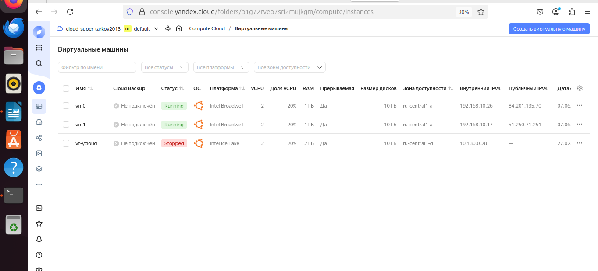
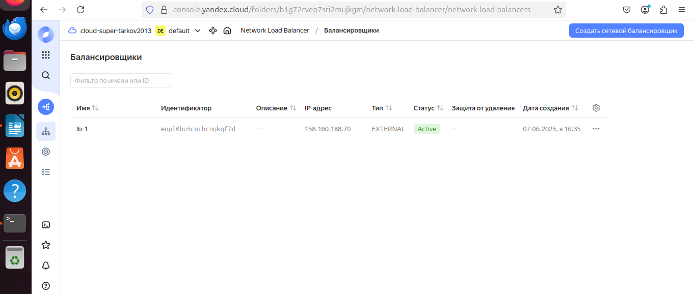
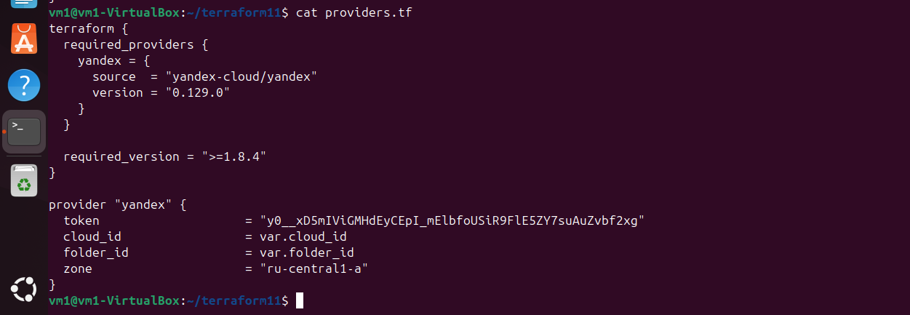
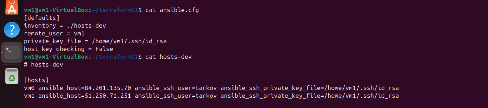
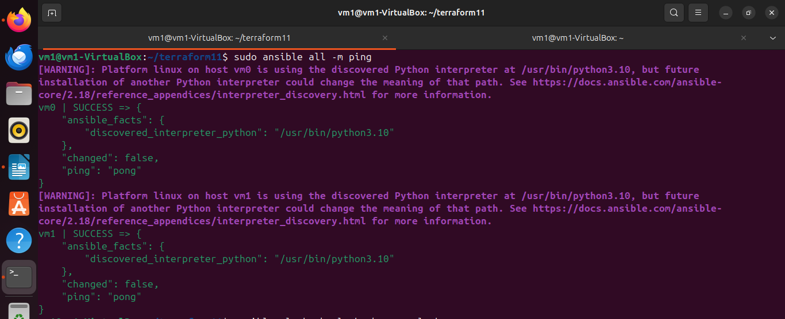
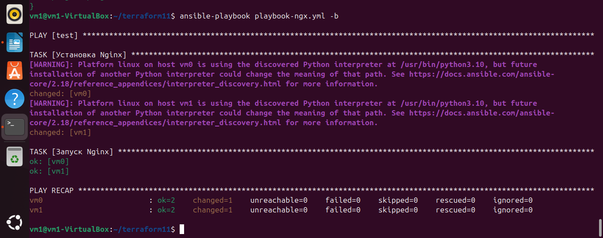
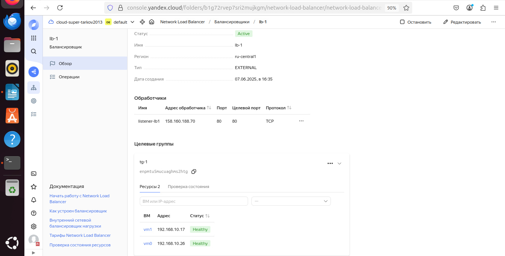
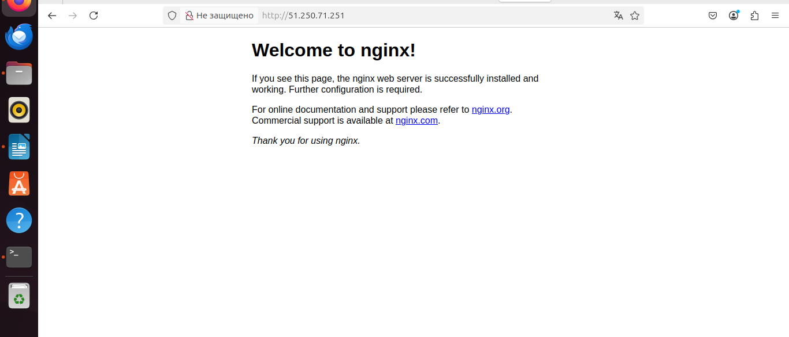
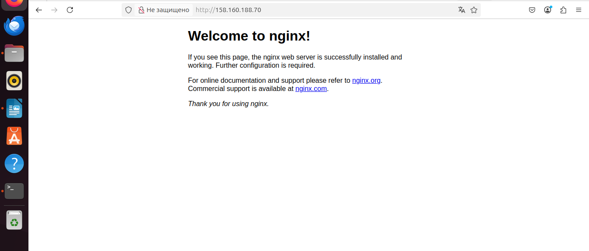

# Домашнее задание к занятию "Отказоустойчивость в облаке" - Tarkov Viktor

### Инструкция по выполнению домашнего задания

   1. Сделайте `fork` данного репозитория к себе в Github и переименуйте его по названию или номеру занятия, например, https://github.com/имя-вашего-репозитория/git-hw или  https://github.com/имя-вашего-репозитория/7-1-ansible-hw).
   2. Выполните клонирование данного репозитория к себе на ПК с помощью команды `git clone`.
   3. Выполните домашнее задание и заполните у себя локально этот файл README.md:
      - впишите вверху название занятия и вашу фамилию и имя
      - в каждом задании добавьте решение в требуемом виде (текст/код/скриншоты/ссылка)
      - для корректного добавления скриншотов воспользуйтесь [инструкцией "Как вставить скриншот в шаблон с решением](https://github.com/netology-code/sys-pattern-homework/blob/main/screen-instruction.md)
      - при оформлении используйте возможности языка разметки md (коротко об этом можно посмотреть в [инструкции  по MarkDown](https://github.com/netology-code/sys-pattern-homework/blob/main/md-instruction.md))
   4. После завершения работы над домашним заданием сделайте коммит (`git commit -m "comment"`) и отправьте его на Github (`git push origin`);
   5. Для проверки домашнего задания преподавателем в личном кабинете прикрепите и отправьте ссылку на решение в виде md-файла в вашем Github.
   6. Любые вопросы по выполнению заданий спрашивайте в чате учебной группы и/или в разделе “Вопросы по заданию” в личном кабинете.
   
Желаем успехов в выполнении домашнего задания!
   
### Дополнительные материалы, которые могут быть полезны для выполнения задания

1. [Руководство по оформлению Markdown файлов](https://gist.github.com/Jekins/2bf2d0638163f1294637#Code)

---

### Задание 1

Возьмите за основу решение к заданию 1 из занятия «Подъём инфраструктуры в Яндекс Облаке».

   1. Теперь вместо одной виртуальной машины сделайте terraform playbook, который:

      - создаст 2 идентичные виртуальные машины. Используйте аргумент count для создания таких ресурсов;
      - создаст таргет-группу. Поместите в неё созданные на шаге 1 виртуальные машины;
      - создаст сетевой балансировщик нагрузки, который слушает на порту 80, отправляет трафик на порт 80 виртуальных машин и http healthcheck на порт 80 виртуальных машин.

Рекомендуем изучить документацию сетевого балансировщика нагрузки для того, чтобы было понятно, что вы сделали.

   2. Установите на созданные виртуальные машины пакет Nginx любым удобным способом и запустите Nginx веб-сервер на порту 80.

   3. Перейдите в веб-консоль Yandex Cloud и убедитесь, что:

      - созданный балансировщик находится в статусе Active,
      - обе виртуальные машины в целевой группе находятся в состоянии healthy.

   4. Сделайте запрос на 80 порт на внешний IP-адрес балансировщика и убедитесь, что вы получаете ответ в виде дефолтной страницы Nginx.

В качестве результата пришлите:

   1. Terraform Playbook

   2. Скриншот статуса балансировщика и целевой группы.
    
   3. Скриншот страницы, которая открылась при запросе IP-адреса балансировщика.

[Terraform Playbook](https://github.com/stimul2520/fault-tolerance-hw/blob/354536ad2413cad8f84b602209e27290191cd456/vms1.tf)

[Nginx Playbook](https://github.com/stimul2520/fault-tolerance-hw/blob/354536ad2413cad8f84b602209e27290191cd456/playbook-ngx1.yml)

